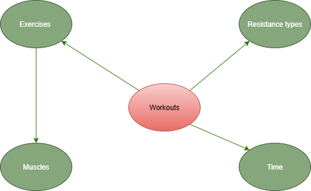

# Gym Data Tracker

> ## Project Scope
> 
> This project wants to create a data pipeline which extracts data from Google Sheets, passes it through a database for
> storage and uses a dimensional
> layer to create real-time Power BI visuals.
>
> ## Personal use 
> Other than practicing, the most exciting part of this project for me is that I am actively using it in my day to day
> life. All the data entering this pipeline is real data from my workout sessions that is being leveraged by myself
> to make decisions for the future and to track my progress. Sure, pen and paper is easier to do, but diagrams tell a 
> better story and creating them manually in Excel is not on the list of my favourite past times during the day. 
> 
> On a more technical note, being able to know exactly which small muscle groups you are targeting more based on your 
> exercise selection via a dashboard is much better for decision making than trying to estimate it from memory.
>
> ## What to expect in this document
> This readme will act as documentation and as a journal where I will describe my process of creating this pipeline.
> I will try to show my thinking process and problems I encountered that made me learn new concepts and techniques.
> Steps described here are not in the exact order they are being presented in as software development is an iterative 
> process, much like many other activities. 

> ## Chapter 1: _Data Modeling_
> ### The Conceptual Model
> The first step was to architecture the Data Warehouse. Before starting 
> to track workouts I needed to think about how 
> I will have my data structured in my DB. 
> I wanted to get straight into writing SQL,
> but I knew it would get messy along the way.
> So I started by creating a conceptual model for my 
> data warehouse.
> 
> 
> 
> I thought about what I want to track in my reports and came up with the model above.
> As I have done in my previous DWH projects, I am going with a mix of Inmon and Kimball's approach 
> to data warehousing. At this stage I am thinking whether reporting from a 3NF layer is 
> a bad practice at the scale of my project. Considering the number of my entities, 
> it should not turn into a join complexity issue when generating reports. If I find that to be the issue I will
> add a dimensional layer on top to ease the engine from handling joins, however I will avoid this for now 
> to reduce the redundancy of the ETL pipeline. I do not want to add extra steps and complexity even though usually that
> is the best practice.
> 
> The entities I want to track in my warehouse are
> 1. **Exercises** -- the actual movement being performed. 
> I was thinking of adding another entity named 'exercise_variations' but I do not have much use 
> for grouping exercises into multiple categories at this point.
> 2. **Muscles** -- the actual skeletal muscles being used in the movements exercised. I did not want to go 
> too in depth with muscles as well because it can become very complex without reaping much analytical 
> reward (e.g. knowing your 20 muscles similar to your flexor hallucis are being worked alongside your calves is not 
> essential information for me at this moment).
> 3. **Workouts**  -- the actual training session. I could have inferred this entity by having date_id + set + exercise be a
> primary key, but I thought about the possibility of having multiple workouts in a day, so I decided to make this an
> entity.
> 4. **Resistance types** -- the equipment or lack thereof used with the exercises. I wanted this as a separate dimension
> because I do not want it tied to the exercises entity through a bridge since almost any exercise can be modified to 
> use any resistance (this is debatable but not relevant in our context)
>
> 
> Now that we have these in mind, we can start adding attributes and think about how they should be related to 
> eachother. 
> 
> ### The Logical Model
> 
> 
> The model displayed above is the next step in our data modeling process. We have defined attributes for each
> identity, we thought about the relationships between our identities, and we also are getting closer 
> to the technical design (the physical model), by thinking about how we will normalize our database.
> 
> The first changes that can be seen in this model is that we added two new tables: dates and exercise_muscles.
> The exercise_muscles table is what is usually called in data modeling as a "bridge table".
> This table maps exercises to muscles being used during those exercises. Its primary function, however, is enabling us 
> to keep our data schema more normalized by avoiding a Many to Many (M-M) relationship between our two tables. By 
> having this bridge table connecting our two dimensions, each dimension has a One-to-Many relationship with the bridge 
> table.
> 
> Another notable change that can be seen is the addition of the "created_at" attribute. This refers to the precise time
> when the row has been created in a specific layer (i.e. loaded from Google Sheets, inserted into the cleansing layer,
> etc.)
>
> 
> In the middle we can see our fact table forming Many-to-One (M:1) relationships with its dimensions through 
> foreign keys (FK) which are the primary keys (PK) in the dimensional tables.
> 
> Now we need to think about which data types we should give each attribute and what other constraints we want to set so
> we keep our data consistent. 
> 
> ### The Physical Model
> This will be completed after I have the last layer in my db so I can use a pgAdmin diagram lmao
> ## Chapter 2: _Extracting with Python_
> 
> I started out by learning how to interact with Google's API's and read from the google sheet. At first I thought about 
> ordering my workouts excel sheets as if one workout would be 1 table, but that would create problems when trying to 
> read from it. Currently it is formatted like a fact table, but without the ID's mapped because no user without OCD
> would sit and fill out ID's by hand on their phone. 
> 
> Afterwards, it was easy to connect to my Postgres database. 
> 
> I then started writing the logic for inserts. The first problem I encountered, the most common one and not much of a 
> problem honestly, was having to map the names of columns such as "set types" to "set_type". I used SQLAlchemy and 
> Pandas to write the inserts and gspread with google's oAuth2 to connect to the sheet in read only mode. 
> 
> First iteration of this process was a huge 350-something lines file. I then thought it might be a little too much and 
> I found navigating the file to be tedious. Also thought something like this would make writing tests harder, so I went
> on to modularize the project and created several functions which pass arguments between eachother and are being called
> in a main function. The though process was to have one function do one thing (one to connect to the sheet, one to 
> connect to the db and 1 insert function per table). 
> 
> After modularizing the extraction process I briefly forgot how to get my error and success messages sent to the main 
> function and learned something probably basic but new to me: passing an empty list such as "error_msgs" to a function
> and then appending to it if there's any errors. I did not want to think of so many unique variable names, so this felt
> like the simplest solution. 
> 
> During the final stages of this project I will need to think about how to migrate this on a Docker container to use 
> Airflow and run my files. I might opt out of having a main function for this and simply orchestrate the smaller 
> functions to maybe have them run on separate threads, but for the scale of this project I shouldn't prematurely 
> optimize but rather focus on having it work and not break. 
> 
> ## Chapter 3: _SQL Procedures and Cleaning_
> 
> After the extraction I decided to use SQL for migration and transformation. I used SQL before for creating objects in 
> the database, then Python for extraction and then SQL again for creating procedures, indexes, functions and all the 
> other objects I would find useful for my project. 
> I prefer SQL over ORM's at the moment because of my time during the Data Analytics Engineering course held by EPAM 
> where we heavily used SQL and learned a lot about its intricacies thus I simply became more comfortable with it.
> 
> So what I did first is create 1 procedure per table to move data from the staging layer to the cleansing layer. 
> To ensure idempotency in my ETL pipeline I created inserts that would not start unless there is a new record present
> in the staging_layer with a different ID from those already present in the target layer aka the cleansing one. I have 
> not thought about slowly changing dimensions yet as this will probably be done exactly after I am done with data 
> cleaning, so the logic for idempotency is to simply make sure I don't have duplicate ID's in my source tables. 
> 
> I know this way is not the hardest and rewarding path, but a clear distinction must be made between being 
> lazy and understanding that if bad data gets in, there's not much you can do to get good value out of it. As engineers
> we are required to work with what we're given, but sometimes if the base materials are not good you simply can't turn 
> them into gold. There is a commonly known phrase for this in the data world that is a bit more informal, which is 
> "shit in, shit out". 
> 
> Onto the cleaning logic, the hardest part of the ETL process in my opinion and the most time-consuming, I decided to 
> write down some rules about how I want to go about my transformations before I started touching any code. 