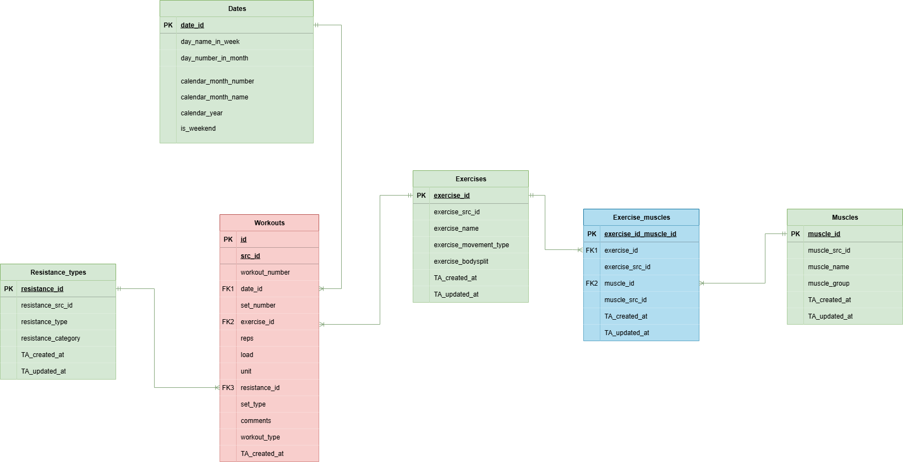

# Gym Data Tracker

> ## Project Scope
> 
> This project wants to create a data pipeline which extracts data from Google Sheets, passes it through a database for
> storage and uses a dimensional
> layer to create real-time Power BI visuals.
>
> ## Personal use 
> Other than practicing, the most exciting part of this project for me is that I am actively using it in my day to day
> life. All the data entering this pipeline is real data from my workout sessions that is being leveraged by myself
> to make decisions for the future and to track my progress. Sure, pen and paper is easier to do, but diagrams tell a 
> better story and creating them manually in Excel is not on the list of my favourite past times during the day. 
> 
> On a more technical note, being able to know exactly which small muscle groups you are targeting more based on your 
> exercise selection via a dashboard is much better for decision making than trying to estimate it from memory.
>
> ## What to expect in this document
> This readme will act as documentation and as a journal where I will describe my process of creating this pipeline.
> I will try to show my thinking process and problems I encountered that made me learn new concepts and techniques.
> Steps described here are not in the exact order they are being presented in as software development is an iterative 
> process, much like many other activities. 
> 
> ## Project overview
> 

>> ## Chapter 1: _Data Modeling_
> ### The Conceptual Model
> The first step was to architecture the Data Warehouse. Before starting 
> to track workouts I needed to think about how 
> I will have my data structured in my DB. 
> I wanted to get straight into writing SQL,
> but I knew it would get messy along the way.
> So I started by creating a conceptual model for my 
> data warehouse.
> 
> 
> 
> I thought about what I want to track in my reports and came up with the model above.
> As I have done in my previous DWH projects, I am going with a mix of Inmon and Kimball's approach 
> to data warehousing. At this stage I am thinking whether reporting from a 3NF layer is 
> a bad practice at the scale of my project. Considering the number of my entities, 
> it should not turn into a join complexity issue when generating reports. If I find that to be the issue I will
> add a dimensional layer on top to ease the engine from handling joins, however I will avoid this for now 
> to reduce the redundancy of the ETL pipeline. I do not want to add extra steps and complexity even though usually that
> is the best practice.
> 
> The entities I want to track in my warehouse are
> 1. **Exercises** -- the actual movement being performed. 
> I was thinking of adding another entity named 'exercise_variations' but I do not have much use 
> for grouping exercises into multiple categories at this point.
> 2. **Muscles** -- the actual skeletal muscles being used in the movements exercised. I did not want to go 
> too in depth with muscles as well because it can become very complex without reaping much analytical 
> reward (e.g. knowing your 20 muscles similar to your flexor hallucis are being worked alongside your calves is not 
> essential information for me at this moment).
> 3. **Workouts**  -- the actual training session. I could have inferred this entity by having date_id + set + exercise be a
> primary key, but I thought about the possibility of having multiple workouts in a day, so I decided to make this an
> entity.
> 4. **Resistance types** -- the equipment or lack thereof used with the exercises. I wanted this as a separate dimension
> because I do not want it tied to the exercises entity through a bridge since almost any exercise can be modified to 
> use any resistance (this is debatable but not relevant in our context)
>
> 
> Now that we have these in mind, we can start adding attributes and think about how they should be related to 
> eachother. 
> 
> ### The Logical Model
> 
> 
> The model displayed above is the next step in our data modeling process. We have defined attributes for each
> identity, we thought about the relationships between our identities, and we also are getting closer 
> to the technical design (the physical model), by thinking about how we will normalize our database.
> 
> The first changes that can be seen in this model is that we added two new tables: dates and exercise_muscles.
> The exercise_muscles table is what is usually called in data modeling as a "bridge table".
> This table maps exercises to muscles being used during those exercises. Its primary function, however, is enabling us 
> to keep our data schema more normalized by avoiding a Many to Many (M-M) relationship between our two tables. By 
> having this bridge table connecting our two dimensions, each dimension has a One-to-Many relationship with the bridge 
> table.
> 
> Another notable change that can be seen is the addition of the "TA_created_at" and "TA_updated_at" attribute. This 
> refers to the precise time
> when the row has been created or updated in a specific layer (i.e. loaded from Google Sheets, inserted into the
> cleansing layer,
> etc.)
>
> 
> In the middle we can see our fact table forming Many-to-One (M:1) relationships with its dimensions through 
> foreign keys (FK) which are the primary keys (PK) in the dimensional tables.
> 
> Now we need to think about which data types we should give each attribute and what other constraints we want to set so
> we keep our data consistent. 
> 
> ### The Physical Model
> 
> The physical model is the technical blueprint of our database. At this stage, we have moved beyond entities and relationships and have defined concrete tables, columns, data types, and constraints.  
> 
> **Key updates in this model:**  
> 
> - **Data Types**  
>   Each attribute now has a specific data type assigned (e.g., `bigint`, `integer`, `numeric`, `character varying`, `timestamp`).  
>   This ensures that the stored data is consistent with its intended use. For example, identifiers such as `exercise_id`, `muscle_id`, or `resistance_id` are stored as `bigint`, while descriptive attributes like `exercise_name` or `muscle_name` are stored as `character varying`.  
> 
> - **Date Dimension**  
>   The `ce_dates` table provides a full date dimension with attributes such as `day_number_in_month`, `calendar_month_number`, and `calendar_year`.  
>   This supports time-based analysis and ensures that all fact records can be consistently tied to a date key.  
> 
> - **Bridge Table**  
>   The `ce_exercise_muscle` table acts as a bridge between `ce_exercises` and `ce_muscles`, resolving the many-to-many relationship by introducing two foreign keys (`exercise_id` and `muscle_id`).  
>   This design keeps the schema normalized while allowing flexibility in associating multiple muscles with each exercise.  
> 
> - **Fact Table**  
>   The `fact_workouts` table captures the measures of interest, such as `reps`, `load`, and `set_number`.  
>   It is linked to dimensions through foreign keys (`date_id`, `exercise_id`, `resistance_id`), ensuring that all recorded workout data can be analyzed in the context of time, exercise details, and resistance type.  
> 
> - **Audit Columns**  
>   Most tables include `ta_created_at` and `ta_updated_at` timestamps.  
>   These provide traceability for when records are inserted or updated across layers of the pipeline, supporting both data lineage and change tracking.  
> 
> - **Referential Integrity**  
>   Relationships are enforced using foreign keys, ensuring that the fact table cannot reference non-existent dimension members, and that the bridge table correctly maps valid exercises to valid muscles.  
> 
> In summary, this physical model transforms our conceptual and logical designs into a fully implementable schema.  
> It establishes the foundation for reliable ETL processes, ensures data consistency, and supports analytical use cases through a normalized yet flexible structure.  

> 
>> ## Chapter 2: _Extracting with Python_
> 
> I started out by learning how to interact with Google's API's and read from the google sheet. At first I thought about 
> ordering my workouts excel sheets as if one workout would be 1 table, but that would create problems when trying to 
> read from it. Currently it is formatted like a fact table, but without the ID's mapped because no user (myself as well)
> would sit and fill out ID's by hand on their phone. 
> 
> Afterwards, it was easy to connect to my Postgres database. 
> 
> I then started writing the logic for inserts. The first problem I encountered, the most common one and not much of a 
> problem honestly, was having to map the names of columns such as "set types" to "set_type". I used SQLAlchemy and 
> Pandas to write the inserts and gspread with google's oAuth2 to connect to the sheet in read only mode. 
> 
> First iteration of this process was a huge 350-something lines file. I then thought it might be a little too much and 
> I found navigating the file to be tedious. Also thought something like this would make writing tests harder, so I went
> on to modularize the project and created several functions which pass arguments between eachother and are being called
> in a main function. The though process was to have one function do one thing (one to connect to the sheet, one to 
> connect to the db and 1 insert function per table). 
> 
> After modularizing the extraction process I briefly forgot how to get my error and success messages sent to the main 
> function and learned something probably basic but new to me: passing an empty list such as "error_msgs" to a function
> and then appending to it if there's any errors. I did not want to think of so many unique variable names, so this felt
> like the simplest solution. 
> 
> During the final stages of this project I will need to think about how to migrate this on a Docker container to use 
> Airflow and run my files. I might opt out of having a main function for this and simply orchestrate the smaller 
> functions to maybe have them run on separate threads, but for the scale of this project I shouldn't prematurely 
> optimize but rather focus on having it work and not break. 
> 
>> ## Chapter 3: _SQL Procedures and Cleaning_
> 
> After the extraction I decided to use SQL for migration and transformation. I used SQL before for creating objects in 
> the database, then Python for extraction and then SQL again for creating procedures, indexes, functions and all the 
> other objects I would find useful for my project. 
> I prefer SQL over ORM's at the moment because of my time during the Data Analytics Engineering course held by EPAM 
> where we heavily used SQL and learned a lot about its intricacies thus I simply became more comfortable with it.
> 
> So what I did first is create 1 procedure per table to move data from the staging layer to the cleansing layer. 
> To ensure idempotency in my ETL pipeline I created inserts that would not start unless there is a new record present
> in the staging_layer with a different ID from those already present in the target layer aka the cleansing one. I have 
> not thought about slowly changing dimensions yet as this will probably be done exactly after I am done with data 
> cleaning, so the logic for idempotency is to simply make sure I don't have duplicate ID's in my source tables. 
> 
> I know this way is not the hardest and rewarding path, but a clear distinction must be made between being 
> lazy and understanding that if bad data gets in, there's not much you can do to get good value out of it. As engineers
> we are required to work with what we're given, but sometimes if the base materials are not good you simply can't turn 
> them into gold. 
> 
> Onto the cleaning logic, the hardest part of the ETL process in my opinion and the most time-consuming, I decided to 
> write down some rules about how I want to go about my transformations before I started touching any code. 
> 
> > *Key operations include:*  
> 
> - **Deduplication**  
>   Removes duplicate records based on a composite key of `workout_number`, `date`, `set_number`, and `exercise`.  
>   Only the record with the lowest `id` is retained.  
> 
> - **Date Standardization**  
>   Converts multiple date formats (`MM/DD/YYYY`, `YYYY.MM.DD`, etc.) into the unified format `YYYY-MM-DD`.  
>   Ensures all fact records can join consistently with the `ce_dates` dimension.  
> 
> - **Numeric Normalization**  
>   Replaces commas with dots for numeric values in the `"load"` column and enforces valid numeric casting.  
>   Invalid or empty loads are set to `0`.  
> 
> - **Special Character Removal**  
>   Cleanses text fields (`exercise`, `comments`, `workout_type`) by removing unsupported characters 
>   and keeping only alphanumeric, whitespace, and basic punctuation.  
> 
> - **Capitalization and Trimming**  
>   Normalizes the casing of attributes like `exercise` and `resistance_type` by capitalizing the first letter 
>   and lowercasing the rest, while trimming extra spaces.  
> 
> - **Splitting Load and Unit**  
>   Detects embedded units (`kg`, `lbs`) in the `"load"` field, moves them into a dedicated `unit` column, 
>   and leaves `"load"` as a pure numeric value.  
> 
> - **Foreign Key Mapping**  
>   Links `exercise` names and `resistance_type` values in the cleansing layer to their corresponding IDs 
>   in `cl_exercises` and `cl_resistance_types`. This ensures referential integrity before moving data into the 3NF model.  
> 
> - **Null Handling**  
>   Replaces `NULL` or empty strings in numeric fields like `reps` and `"load"` with default values (`0`).  
>   This follows the project rule of using `-1` for numeric missing values and `'N/A'` for text where appropriate.  
> 
> - **Row Tracking**  
> Each step uses `GET DIAGNOSTICS` to log the number of rows affected (deleted, updated, or standardized).  
> At the end, a summary message I've composed is raised to provide transparency on how many rows were changed in each 
> category.  
> 
> This procedure ensures that all data moving from the cleansing layer into the 3NF physical model 
> is **deduplicated, standardized, and aligned with schema constraints**, laying the foundation for 
> accurate downstream analytics and reporting.  
> 
> > ## Chapter 4: _Loading into 3NF_
> 
> Once the cleansing logic was in place and my data was standardized, the next step in my ETL pipeline was to load the 
> cleaned records into the **3NF layer**. To keep this process consistent and repeatable, I designed a set of SQL 
> procedures that handle inserts from the cleansing layer into the 3NF schema.  
> 
> For example, the procedure `load_workouts_to_3nf()` is responsible for moving records from 
> `cleansing_layer.cl_workouts` into `bl_3nf.fact_workouts`.  
> This ensures that each workout fact is connected to its corresponding dimensions (`ce_exercises`, 
> `ce_resistance_types`, `ce_dates`) and stored in a normalized format.  
> 
> **Key aspects of the loading procedure:**  
> 
> - **Surrogate Keys**  
>   The fact table (`fact_workouts`) uses a sequence (`workout_id_seq`) to generate new surrogate keys, ensuring that 
>   each record has a unique identifier independent from the source system.  
> 
> - **Source Tracking**  
>   The original source ID from the cleansing layer is preserved as `src_id`, enabling lineage tracking and making it 
>   possible to trace back any record to its raw input.  
> 
> - **Referential Integrity**  
>   During the insert, the procedure joins the cleansing layer records with the dimension tables (`ce_exercises`, 
>   `ce_resistance_types`). If a matching dimension record exists, the appropriate foreign key is assigned.  
>   If no match is found, default placeholder values (`-1` for numeric IDs, `'N/A'` for text) are used to keep referential 
>   integrity intact while still capturing the record.  
> 
> - **Default and Fallback Values**  
>   To avoid nulls in critical attributes, I used `COALESCE()` throughout the insert statement. For example:  
>   - Dates default to `1900-01-01` if missing.  
>   - Numeric values (e.g., `reps`, `load`, `set_number`) default to `-1`.  
>   - Text values (e.g., `unit`, `comments`, `set_type`) default to `'N/A'`.  
>   This follows the project’s convention for handling missing data in a consistent and predictable manner.  
> 
> - **Idempotency**  
>   The procedure ensures no duplicate inserts occur by checking if the record’s `src_id` already exists in the target 
>   fact table. Only new records are inserted.  
> 
> - **Auditing and Logging**  
>   After each insert operation, `GET DIAGNOSTICS` retrieves the number of rows affected, and a `NOTICE` is raised.  
>   This provides real-time feedback about how many rows were successfully loaded into the 3NF fact table.  
>   In case of errors, the procedure captures the exception details (`MESSAGE_TEXT`, `DETAIL`, `HINT`) and logs them 
>   with a custom message.  
> 
> In summary, the loading procedures act as the **bridge between the cleansing layer and the 3NF schema**, enforcing 
> consistency, traceability, and integrity. By combining surrogate keys, default values, and error handling, the ETL 
> pipeline ensures that the analytical layer always receives clean, reliable, and properly structured data.  

> > ## Chapter 5: _Tests and Data Validation_
> 
> After implementing the procedures for cleaning and loading data into the 3NF layer, I focused on ensuring that the data pipeline behaved consistently and correctly. Rather than assuming everything would work, I established a testing framework that gave me confidence in both the logic and the execution.
> 
> ### Testing Strategy
> 
> The testing approach covered two main areas:  
> 
> 1. **Connectivity and Setup**  
>    - Verified that the database connection logic worked correctly.  
>    - Ensured that extraction and loading functions always had a valid connection to work with.  
> 
> 2. **Data Extraction and Validation**  
>    - Simulated data extraction to check that only new, non-duplicate records were inserted into the staging tables.  
>    - Confirmed that duplicate entries were correctly ignored.  
>    - Checked that the number of rows passed to the database matched expectations.  
> 
> By testing both the connection and the data itself, I could ensure that the pipeline was functioning end-to-end.
> My focus was on idempotency and data validation.
> 
> ### Continuous Integration with GitHub Actions
> 
> To practice and catch issues early, I integrated the test suite into **GitHub Actions**. Every time code changes are pushed:  
> 
> - Tests verify that database connections can be established.  
> - Data extraction and deduplication logic are validated automatically.  
> - Any failures are immediately reported, providing fast feedback.  
> 
> I have built my tests so as they can be ran locally and inside GitHub's containers and still give value.
> 
> ### Flexibility and Portability
> 
> A key advantage of this testing strategy is its portability. I can run the tests locally with the same environment variables that CI/CD pipelines use. This consistency reduces debugging overhead and ensures that the pipeline behaves predictably in every scenario.
> 
>> ## Chapter 6: _Airflow, DAGs and Docker Containers_
> 
> Now I had to choose how I would orchestrate this pipeline so that I do not have to manually refresh my database all 
> the time. 
> I decided to go with Airflow as it is the industry standard and I used it before. The problem was that I am a Windows 
> user and Airflow is not compatible with this OS. I pondered about whether to install Airflow on WSL or to have it inside 
> of a Docker container. For simplicity I could have used it in WSL, but I wanted to practice managing Docker containers 
> so for the sake of some DevOps work and some little networking I went with Airflow on a Docker container. 
> 
 > Once I knew Airflow was the way to go, I had to figure out how to actually set up my DAGs so that I didn’t have 
> to keep running things by hand. I started simple — my first DAG was just about refreshing the database. Normally 
> I’d connect to Postgres and run stored procedures myself, but with Airflow I could use the PostgresOperator 
> and let it do the job for me on a schedule. It felt pretty cool watching it happen automatically the first time.  
> 
> After that, I wanted to deal with Power BI. I didn’t want my reports showing old data while the database was 
> already updated. So I built another DAG that kicks in right after the database DAG finishes. That DAG calls 
> the Power BI REST API and tells it to refresh the dataset. This way, Power BI only refreshes when the data 
> is actually ready — no more guessing or waiting.  
> 
> > ## Chapter 7: _Power BI, analytics and reports_ 
> 
> In order to have my data refreshed I had to configure a on-premises data gateway which I have done before but now I 
> SQL server uninstalled. I decided to go on and install the postgres variant **Npgsql** as I have heard is open source.
> Unfortunately I could not manage the drivers and the connections as my data gateway did not want in any way, shape or 
> form to connect to my local database from Power BI Service. 
> Defeated, I installed SQL Server again and tried once more. 
> Defeated again as I realized I would have to migrate my database, I tried my PostgreSQL connection in Power BI Service 
> and now it worked. Somehow the connection worked. I checked my pg_hba.conf and my postgresql.conf file to make sure 
> Postgres would accept the connection before and I have changed nothing, but after a while my data gateway was finally 
> able to pick my postgres server up. 
> 
> Thus, I successfully configured the connection between my local Postgres database to Power BI Service. 
> Now I just need to finish my report and integrate my refresh in Airflow with the refresh API. 
> 
> Then reality hit and I figured if I needed to call the API I would need to create a service account in Microsoft 
> Azure. For legal reasons, I would first need to ask for approval to create this resource. As this would have been 
> quite a weird email and my desire to buy a Power BI Pro license for myself is next to null as I would not use it for 
> much other than simply getting the practice to use the API, I decided to drop my plans for viewing the report on my 
> phone from Power BI Service automatically and refresh it on a schedule or manually. I would still be able to see it 
> on my phone, but it would be up to date only if I had my laptop opened so the report can be refreshed. This is something 
> I can live with rather than deal with legal complications for a passion project. 
> 
> So I started getting to actually building the report and choosing themes and making it look nice. I wanted to be 
> practical with this report as design is not really my strong point but asking questions is. 